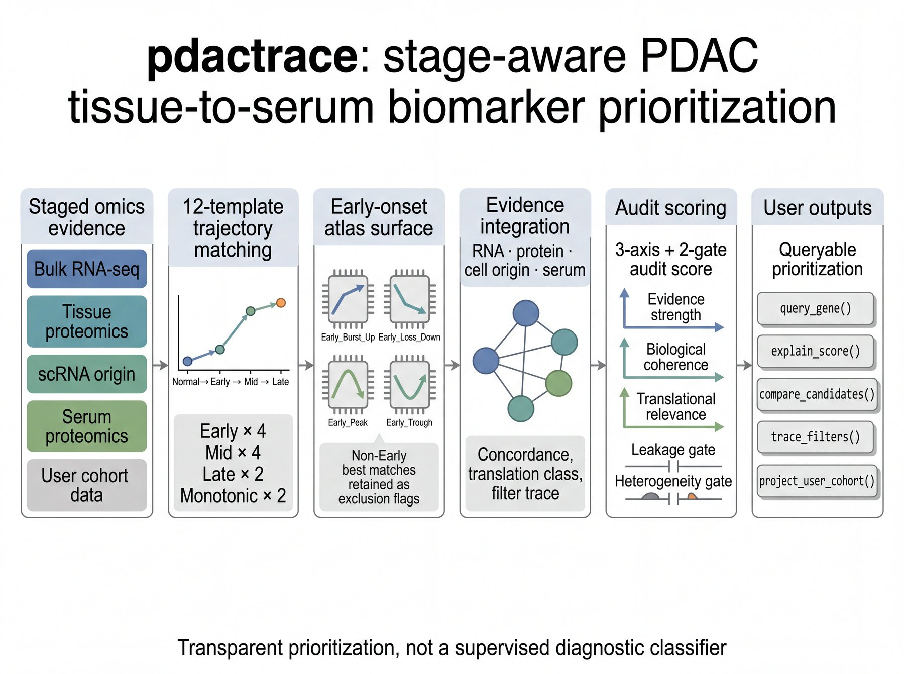

# pdactrace

> Stage-aware PDAC multi-omics atlas and transparent evidence-audit
> framework for tissue-to-serum biomarker prioritization.

[](https://github.com/jibeomko/pdactrace/actions/workflows/R-CMD-check.yaml)
[](https://github.com/jibeomko/pdactrace/releases)
[](https://opensource.org/licenses/MIT)
[](https://www.bioconductor.org/)
[](https://doi.org/10.5281/zenodo.20069896)

<p align="center">
  
</p>

`pdactrace` is an R package for querying and prioritizing pancreatic
ductal adenocarcinoma (PDAC) biomarker candidates across bulk RNA-seq,
tissue proteomics, single-cell RNA-seq, serum proteomics, and
pancreatitis context.

It does **not** train a supervised biomarker classifier. Instead, it
uses a frozen, interpretable scoring rule and reports uncertainty
because PDAC early detection lacks robust gene-level ground truth.

## What You Get

- A bundled reference atlas: **10,113 genes x 113 columns**
- A **12-template competitive trajectory catalog** with an Early x 4
  atlas surface
- A transparent **3-axis + 2-gate audit score**
- Per-gene lookup, panel lookup, candidate listing, filter tracing,
  and visualization APIs
- User-cohort helpers for applying the same framework to new RNA or
  protein evidence

Core message: **a PDAC tissue biomarker is not always a serum-up
biomarker.** Tissue signals can preserve, invert, or decouple when
projected into serum.

## Install

```r
# install.packages("remotes")
remotes::install_github("jibeomko/pdactrace")
```

A Bioconductor submission is in preparation.

## Quick Start

```r
library(pdactrace)

# Look up one gene
query_gene("LGALS3BP")

# Compare a small panel
query_panel(c("LGALS3BP", "SERPINA1", "ALB", "GAPDH"))

# Inspect stage and cohort detail
query_gene_detailed("SERPINA1")$per_stage
query_gene_detailed("SERPINA1")$per_cohort

# List candidates
list_candidates(translation_class = "inverse")
list_candidates(onset = "Early", tissue_direction = "Up")

# Trace why selected genes pass or fail the tissue-to-serum funnel
trace_filters(c("SERPINA1", "SPARC", "CDH13", "GAPDH"))
```

## Audit Scoring

Each gene is scored with three evidence axes and two reliability gates:

```text
positive_score = 0.40 * evidence_strength
               + 0.35 * biological_coherence
               + 0.25 * translational_relevance

audit_score = positive_score * leakage_gate * heterogeneity_gate
```

The score is deterministic; Monte Carlo summaries report rank stability
under evidence perturbation. External anchors are used for post-freeze
evaluation only, not training.

| Audit label | Typical meaning |
|---|---|
| `high_confidence` | Strong multi-layer support with clean gates |
| `supported_uncertain` | Supported, but cohort-heterogeneous or moderate score |
| `penalized` | Plasma high-abundance penalty |
| `excluded` | Housekeeping or leakage artifact |
| `low` | Insufficient evidence |

```r
compute_audit_score(c("LGALS3BP", "SERPINA1", "ALB", "GAPDH"))
propagate_uncertainty(c("LGALS3BP", "SERPINA1", "GAPDH"))
anchor_enrichment(top_n = 100, tier = "secondary")  # alias of evaluate_anchor_enrichment
```

The frozen audit rule recovers **7 secondary-tier external anchors in
the top 100** (`39.3x`, hypergeometric `p = 2.18e-10`).

## Trajectory Framework

Each gene's Normal/Early/Mid/Late trajectory is matched against 12
pre-declared templates:

| Family | Templates | Atlas surface? |
|---|---|---|
| **Early x 4** | `Early_Burst_Up`, `Early_Loss_Down`, `Early_Peak`, `Early_Trough` | surfaced (`rna_pattern`) |
| **Mid x 4** | `Mid_Plateau_Up`, `Mid_Plateau_Down`, `Mid_Peak`, `Mid_Trough` | flagged via `excluded_mid_pattern` |
| **Late x 2** | `Late_Burst_Up`, `Late_Loss_Down` | flagged via `excluded_late_pattern` |
| **Monotonic x 2** | `Monotonic_Up`, `Monotonic_Down` | flagged via `excluded_monotonic_pattern` |

Only Early x 4 calls are surfaced in `rna_pattern` / `prot_pattern`.
Non-Early best matches remain visible as exclusion flags. This makes
Early calls stricter: a candidate must beat Mid, Late, and Monotonic
alternatives before being surfaced.

## Reference Atlas

The bundled `pdactrace_reference` object is a `data.table` with
**10,113 genes x 113 columns**. It includes RNA trajectory evidence,
tissue-protein support, scRNA cell-origin summaries, serum translation
features, pancreatitis context, audit scores, uncertainty summaries,
and provenance.

Important bundled data:

| Object | Role |
|---|---|
| `pdactrace_reference` | Main 10,113-gene atlas |
| `default_templates` | Canonical 12-template trajectory catalog |
| `pdactrace_external_anchors` | External anchor set for post-freeze evaluation |
| `meta_analysis` | Random-effects RNA meta-analysis summaries |

## Common Plots

```r
plot_gene_evidence("LGALS3BP")
plot_filter_trace(c("SERPINA1", "SPARC", "CDH13", "GAPDH"))
plot_candidate_landscape()
plot_stage_effect("SERPINA1")
plot_per_cohort("SERPINA1")
plot_meta_forest("SERPINA1", contrast = "Mid_vs_Early")
plot_gene_hexagon("LGALS3BP", comparison = "high_confidence_mean")
```

## Use Your Own Cohort

The v0.4.0 API lets users apply the same trajectory and audit framework
to staged RNA or tissue-protein data:

```r
rna_fit <- fit_stage_de(counts, stage, cohort)
rna_pat <- classify_trajectory(rna_fit)

prot_fit <- fit_stage_de_protein(intensity, stage, cohort)
prot_pat <- classify_prot_trajectory(prot_fit)  # alias of classify_protein_trajectory

evidence <- assemble_user_evidence(rna_fit = rna_pat, prot_fit = prot_pat)
compute_audit_score(evidence = evidence)
```

## Function name aliases (v0.4.1)

The following short aliases are exported alongside their fully-spelled
originals; both forms refer to the same function.

| Long name | Short alias |
|---|---|
| `evaluate_anchor_enrichment()` | `anchor_enrichment()` |
| `early_pattern_names()` | `early_patterns()` |
| `mid_pattern_names_excluded()` | `mid_patterns()` |
| `align_patient_profile()` | `align_patient()` |
| `classify_protein_trajectory()` | `classify_prot_trajectory()` |

Use whichever you prefer — existing scripts using the long names continue
to work unchanged.

## Vignettes

```r
vignette("lookup_basics", package = "pdactrace")
vignette("audit_case_studies", package = "pdactrace")
vignette("audit_framework", package = "pdactrace")
vignette("user_cohort_extension", package = "pdactrace")
```

## Reproducibility

The R package ships with the reference atlas, the canonical 12-template
trajectory catalog, the external anchor set, tests, and the build
scripts under `data-raw/` that regenerate the bundled `data/*.rda`
files end-to-end.

```r
# Rebuild the bundled atlas + auxiliary objects from data-raw/
source("data-raw/build_reference.R")
source("data-raw/build_templates.R")
source("data-raw/build_meta_analysis.R")
source("data-raw/build_atlas_metadata.R")
```

Full multi-omics analysis pipelines (FASTQ → DESeq2 / scVI / FragPipe
→ phase scripts) and the BiB manuscript assets live in a separate
companion repository, [PDAC_biomarker_manuscript](https://github.com/jibeomko/PDAC_biomarker_manuscript),
which carries its own Zenodo archive
([10.5281/zenodo.20067849](https://doi.org/10.5281/zenodo.20067849)).

Key bundled data:

| File | Role |
|---|---|
| `data/pdactrace_reference.rda` | Bundled 10,113-gene atlas |
| `data/default_templates.rda` | Canonical 12-template catalog |
| `data/pdactrace_external_anchors.rda` | External anchor set |
| `data/meta_analysis.rda` | Random-effects RNA meta-analysis summaries |
| `data/atlas_metadata.rda` | Atlas provenance + cohort manifest |

## Citation

If you use `pdactrace`, please cite the software via its Zenodo DOI:

> Ko, J. (2026). *pdactrace: Queryable Stage-Aware PDAC Tissue-to-Serum
> Biomarker Reference Atlas* (v0.99.0) [Software]. Zenodo.
> [10.5281/zenodo.20069896](https://doi.org/10.5281/zenodo.20069896)

```bibtex
@software{pdactrace2026,
  author       = {Ko, Jibeom},
  title        = {{pdactrace: Queryable Stage-Aware PDAC
                   Tissue-to-Serum Biomarker Reference Atlas}},
  year         = 2026,
  version      = {v0.99.0},
  publisher    = {Zenodo},
  doi          = {10.5281/zenodo.20069896},
  url          = {https://doi.org/10.5281/zenodo.20069896}
}
```

The accompanying *Briefings in Bioinformatics* manuscript reference
will be added once the preprint or journal DOI is available.

## License

MIT. See [LICENSE](LICENSE).
